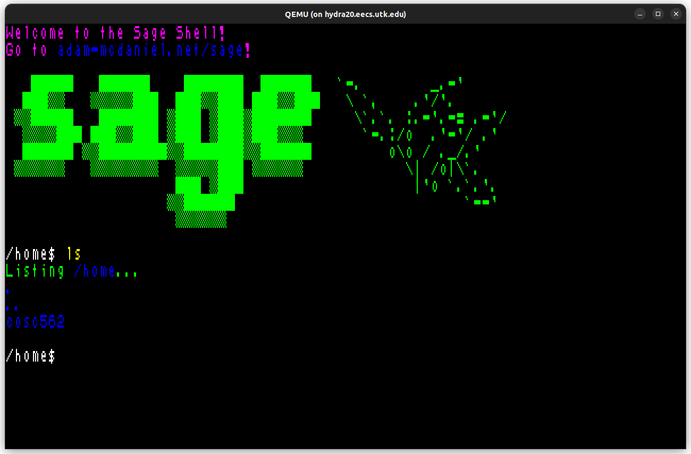
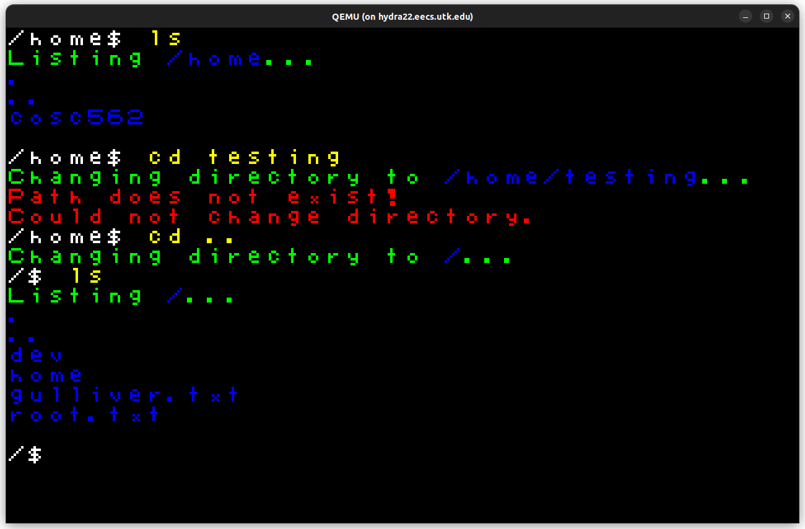
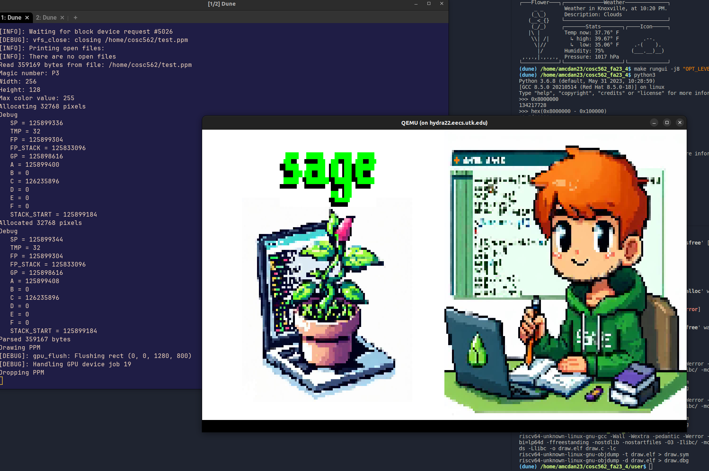
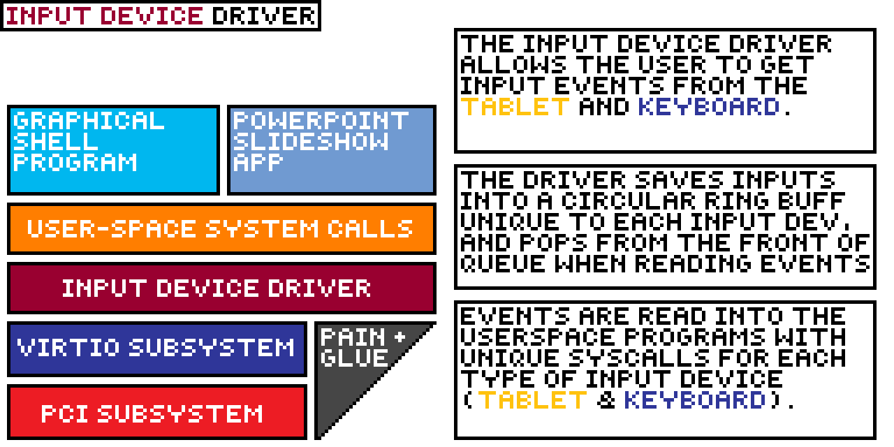
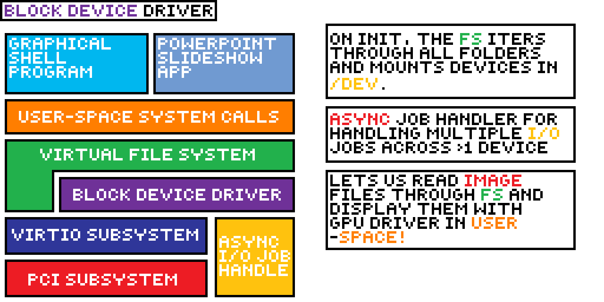
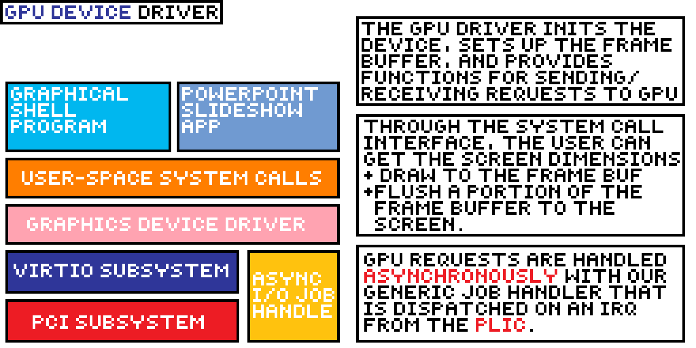

# Sage OS

A RISC-V operating system that supports [the Sage programming language](https://github.com/adam-mcdaniel/sage)!

## Authors

- Adam McDaniel (68% of lines in `src`)
- Dr. Stephen Marz (23% of lines in `src`)
- Jongheon Park (7% of lines in `src`)
- Gaddy Morales (1% of lines in `src`)
- Tokey Tahmid (<1% of lines in `src`)

## User Space Programs

<!-- A center aligned div with two images side-by-side -->

[Click here for a video demonstration of the graphical shell and powerpoint presentation app!](https://docs.google.com/file/d/1k5CjkdbnrRzwfMCuE0A5eFRi_f5it75K/preview) Both programs are written in [Sage](https://github.com/adam-mcdaniel/sage)!

    
    

    

## Major Features

Sage OS supports VirtIO drivers for the following devices connected to the QEMU virtual machine through the peripheral component interconnect (PCI) bus:

### Input devices (keyboard and tablet)

### Block devices (hard disk)

### Graphics devices (GPU)

